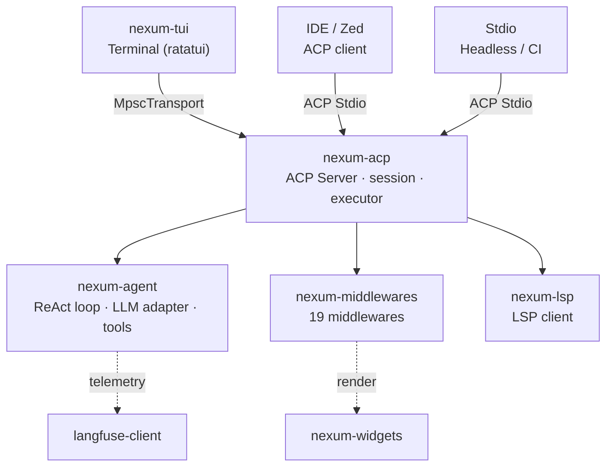

<div align="center">

# Nexum Runtime

**Local-first AI agent runtime in Rust — pre-release, experimental, under active development.**

[](https://opensource.org/licenses/Apache-2.0)
[](https://www.rust-lang.org/)
[](#installation)

</div>

> **Status:** Nexum Runtime is an experimental project in active development (release candidate). It is not a finished product. Interfaces, internal APIs and behavior may change without notice.

---

## What is Nexum

Nexum Runtime is an AI agent framework written in Rust. It provides a ReAct execution loop, an extensible middleware layer, an Agent Client Protocol (ACP) server for IDE integration, and an interactive terminal UI.

The project started as a fork of [Peri](https://github.com/KonghaYao/peri) and has since developed its own identity and direction.

### Core capabilities

- **ReAct loop** with up to 500 iterations per session
- **Multi-provider:** Anthropic, OpenAI, DeepSeek, GLM, Qwen (hot-swappable at runtime)
- **Claude Code compatible:** existing skills, hooks, MCP servers and plugins work
- **19 middlewares** in the chain: filesystem, terminal, HITL, SubAgent, Skills, MCP, Hooks, Compact, LSP, and more
- **Tool Search:** the LLM only sees ~14 core tools; the rest are discovered on demand
- **SubAgent fork:** delegation of tasks to specialized background agents
- **Memory gateway:** selective context injection into the prompt
- **Voice:** experimental integration with ASR and TTS engines
- **Automatic compact:** long sessions stay efficient
- **agm:** package manager for skills and agents

---

## Architecture

Nexum is a layered platform where the **agent core** is decoupled from the **frontend** through the [Agent Client Protocol](https://agentclientprotocol.com).



### Workspace crates

| Crate | Responsibility |
|---|---|
| `nexum-agent` | Core: ReAct loop, LLM adapters, tool system, SQLite persistence |
| `nexum-middlewares` | 19 middlewares: filesystem, terminal, HITL, SubAgent, Skills, MCP, Hooks, Compact, LSP, etc. |
| `nexum-widgets` | UI components (ratatui + pulldown-cmark) |
| `nexum-acp` | ACP server: TUI/IDE ↔ Agent bridge |
| `nexum-acp-host` | ACP server host binary |
| `nexum-tui` | TUI application + `nexum` binary |
| `nexum-lsp` | LSP client |
| `langfuse-client` | Langfuse telemetry client |
| `agm` | Agent Package Manager |
| `nexum-web-pty` | Web PTY bridge (xterm frontend) |

---

## Requirements

### Build dependencies

- **Rust:** edition 2021 (1.80 or newer; rustc 1.95.0 is used in CI)
- **git:** required by `scripts/nexum-package` to record source provenance in the manifest

### Runtime dependencies

- **Linux:** a recent glibc-based distribution. No Rust toolchain required at runtime.
- **Python 3 (stdlib only):** required at runtime for provider/sidecar functionality (catalog generation, credential probing, bridge supervisor). No pip packages required — the sidecars use only the standard library.
- **macOS / Windows:** a Windows installer exists (`scripts/nexum-install.ps1`) but is not yet validated in CI. See [Platform status](#platform-status).

### Accounts

- **API key:** required from a supported provider (Anthropic, OpenAI, DeepSeek, GLM, Qwen).

---

## Installation

### Linux (verified)

Nexum ships a reproducible install pipeline based on the `InstalledLayoutV1` layout:

```bash
# 1. Build and package an installable artifact
NEXUM_SOURCE_HEAD=$(git rev-parse HEAD) \
NEXUM_SOURCE_TREE=$(git rev-parse HEAD^{tree}) \
  scripts/nexum-package 0.1.4-rc.4 dist/

# 2. Install into ~/.local (uses the artifact, no checkout required at runtime)
dist/nexum-0.1.4-rc.4-linux-x86_64/nexum-install --prefix "$HOME/.local"

# 3. Verify
nexum --version   # → nexum 0.1.4-rc.4
nexum doctor      # → 55 checks
```

Installed layout:

```
~/.local/
├── bin/
│   ├── nexum → ../lib/nexum/current/nexum
│   ├── nexum-acp-host
│   └── nexum-autologin-reconcile
└── lib/nexum/
    ├── current → 0.1.4-rc.4
    └── 0.1.4-rc.4/         (versioned runtime + MANIFEST.json + configs + sidecars)
```

Rollback to a previously installed version:

```bash
scripts/nexum-install --prefix "$HOME/.local" --rollback 0.1.4-rc.3
```

### Windows

An installer exists at `scripts/nexum-install.ps1` (installs `lib/nexum/<version>` with a `current` junction, `.cmd` shims and user PATH entry; `scripts/nexum-uninstall.ps1` removes it).

**Platform status:** build is configured in CI; the installer has not yet been validated on a real Windows host. Windows is **NOT SUPPORTED** until validated.

### macOS

Build targets for `x86_64-apple-darwin` and `aarch64-apple-darwin` are configured in the release workflow.

**Platform status:** BUILD UNVERIFIED — no macOS host is available in this project's development environment, and the packaging pipeline has not been exercised on macOS.

---

## Quickstart (from source)

```bash
cargo build -p nexum-tui --release

# Interactive TUI
target/release/nexum

# Headless single question
target/release/nexum -p "What is Rust?"

# Headless without tool permissions (fail-closed by default)
target/release/nexum -p "hello" --dangerously-skip-permissions
```

### CLI flags

| Flag | Description |
|---|---|
| `-p/--print [PROMPT]` | Non-interactive mode: one question, answer, exit |
| `-a/--approve` | Enable HITL (manual approval of sensitive tools) |
| `--permission-mode` | `bypass`, `default`, `dont-ask`, `accept-edit`, `auto-mode` |
| `--dangerously-skip-permissions` | Total permission bypass (same as `--permission-mode bypass`) |
| `--model` | Select model (e.g. `sonnet`, `gpt-4o`, `deepseek-chat`) |
| `--effort` | Reasoning effort: `low`, `medium`, `high`, `max` |
| `-c/--continue` | Continue the most recent conversation |
| `-r/--resume [ID]` | Resume a session by ID |

---

## Configuration

### Providers and models

Nexum supports multiple providers through OpenAI-compatible and Anthropic adapters:

| Provider | Example models |
|---|---|
| Anthropic | Claude Sonnet, Claude Opus |
| OpenAI | GPT-4o, GPT-4.1 |
| DeepSeek | deepseek-chat, deepseek-v4-pro |
| GLM | glm-4-plus |
| Qwen | qwen-max |

The provider catalog and route registry ship as JSON configs under `config/`:

- `provider-catalog-base.json` — provider definitions, auth modes, model lists
- `provider-route-registry.json` — executable routes per provider
- `catalog-contract.json` — schema contract for the catalog

Provider detection is automatic, or can be forced with `--model`. Hot-switching is supported during a session.

### Memory (Memory Gateway)

Selective context injection into the agent prompt:

- Memory selection with relative threshold and token ceiling
- Injection trace for debugging
- HTTP gateway for external persistence

Experimental — API may change.

### Local AI / Voice

Experimental voice integration:

- **ASR (Speech-to-Text):** Whisper via `asr_whisper`
- **TTS (Text-to-Speech):** adapters for multiple engines (Piper, Kokoro)
- **ACP turn:** voice turn handling over ACP

Voice is experimental: not all integrations are complete and engine availability depends on local assets.

---

## Security

Nexum implements layered permissions:

### HITL (Human-In-The-Loop)

By default the following tools require explicit user approval:

- `Bash` (command execution)
- `Write` / `Edit` (file modification)
- `Agent` (sub-agent delegation)
- `WebFetch` / `WebSearch` (HTTP requests)
- `delete_*` / `rm_*` (file deletion)
- `mcp__*` (MCP tools)
- `cron_register` (scheduled tasks)

### Defaults

- **YOLO mode:** disabled by default; only activates with explicit `YOLO_MODE=true`
- **Print mode (`-p`):** fail-closed by default; requires `--dangerously-skip-permissions` to execute sensitive tools
- **ACL:** unsafe runtime directories fail closed

### SSRF guard

HTTP hook protection against Server-Side Request Forgery:

- Blocks private IPv4 ranges (10.0.0.0/8, 172.16.0.0/12, 192.168.0.0/16)
- Blocks link-local (169.254.0.0/16) and CGNAT (100.64.0.0/10)
- Blocks IPv6 unique-local and link-local
- Allows loopback (127.0.0.0/8) for local development

### Path canonicalization

Paths are canonicalized before HITL to resolve symlinks and prevent path traversal.

---

## Testing

```bash
# All tests (workspace)
cargo test --workspace

# Single crate
cargo test -p nexum-agent
cargo test -p nexum-middlewares

# Single test
cargo test -p nexum-tui --lib -- <test_name>
```

The CI pipeline (`ci.yml`) runs lint (Ruff + mypy) and the full test suite on Linux, macOS and Windows.

---

## Known limitations

- **Read/Glob/Grep:** can access any file on the system. There is no per-directory sandboxing. You must trust the agent.
- **WebFetch/WebSearch:** HTTP requests go through the Tavily proxy. The SSRF guard does not directly cover these tools.
- **Internal APIs:** middleware and ACP APIs may change between versions.
- **Testing:** a few tests may be environment-sensitive (git repo state, permissions, terminal).
- **Windows/macOS:** installers/builds are not yet validated on those platforms.

---

## Troubleshooting

| Symptom | Check |
|---|---|
| `nexum: command not found` | Is `~/.local/bin` in `PATH`? Is the install prefix correct? |
| `nexum doctor` reports missing catalog | Reinstall: the runtime resolves `provider-catalog-output.json` from its install slot, not from a checkout |
| `No se pudo lanzar python3` | Python 3 is required at runtime for provider/sidecar functionality (stdlib only) |
| TUI fails to start with `No such device or address` | TUI requires a TTY; use `-p` mode or a real terminal |
| Tests fail in a dirty git tree | `nexum-package` refuses to package an uncommitted tree (source provenance) |

---

## Contributing

The project is under active development. Contributions are welcome, with the caveat that:

- Internal APIs may change without notice
- Issues are tracked in this repository
- CI runs lint + full test suite before merge

---

## Attributions

Nexum Runtime originated as a fork of [Peri](https://github.com/KonghaYao/peri) (Copyright KonghaYao contributors, Apache 2.0). See [NOTICE](NOTICE) for details.

Key dependencies and technologies:

- [ACP](https://agentclientprotocol.com) — open protocol for agent-IDE communication
- [rmcp](https://github.com/anthropics/rmcp) — Rust MCP client
- [Ratatui](https://ratatui.rs) — TUI framework
- [Tokio](https://tokio.rs) — async runtime
- [Langfuse](https://langfuse.com) — LLM observability

---

## License

Apache 2.0 — see [LICENSE](LICENSE) and [NOTICE](NOTICE) for attributions.

---

> **Note:** Nexum Runtime is an experimental project. Production use is not recommended at this stage. Interfaces, behavior and APIs may change between any versions.
