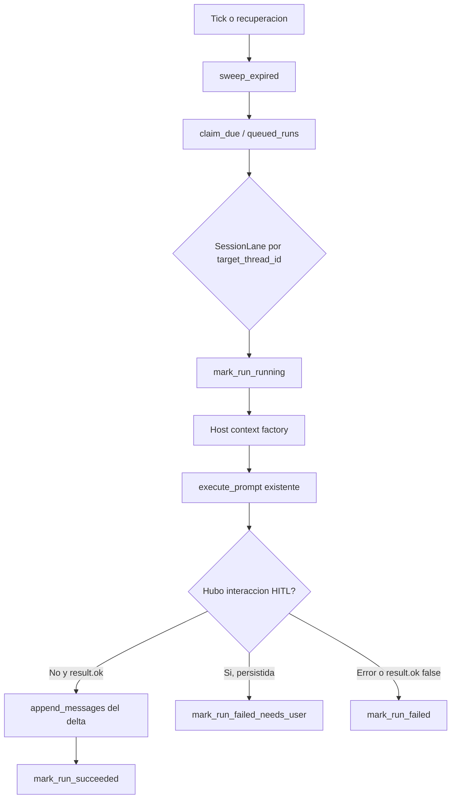

# Nexum Cron Runtime

## Proposito y alcance

`nexum_acp::cron` aporta scheduling durable y host-neutral para prompts ACP. El runtime conserva jobs, corridas e interacciones en SQLite, reclama vencimientos y delega cada corrida a un adaptador. No crea un segundo loop de agente, provider, ThreadStore ni protocolo de sesiones.

El host local `nexum-acp-host` instala el adaptador disponible hoy: carga el thread objetivo, construye un `PromptExecutionContext` normal y llama una vez a `session::executor::execute_prompt` por corrida. Por eso un cron continua una conversacion existente en lugar de abrir una nueva.

El modulo no expone por ACP operaciones para crear, editar, habilitar, pausar, reanudar, borrar o listar jobs/runs. `SqliteCronStore` tiene APIs Rust para crear/listar/consultar jobs y runs; la API ACP actual se limita a interacciones pendientes.

## Componentes

| Componente | Responsabilidad |
|---|---|
| `CronRuntime` | Tick, reclamacion de vencimientos, recuperacion de corridas interrumpidas y serializacion por thread. |
| `SqliteCronStore` | Persistencia SQLite, migraciones, claim atomico, estados terminales e interacciones pendientes. |
| `CronRunExecutor` | Limite host-neutral para ejecutar una ocurrencia reclamada. |
| `ExecutePromptRunner` | Adaptador que ejecuta el pipeline ACP existente y persiste el delta de mensajes al completar. |
| `CronPromptContextFactory` | Contrato del host para construir el contexto de prompt desde job/run. |
| `HeadlessPromptContextFactory` | Implementacion local: recupera metadata e historial del thread objetivo y usa un sink de eventos vacio. |
| `HeadlessFailSafeBroker` | Broker HITL sin cliente: persiste la interaccion, rechaza/contesta vacio y cancela el agente. |
| `SqlitePendingInteractionBroker` | Gestion durable y autorizada de interacciones pendientes para ACP. |

## Flujo de una ocurrencia

Al iniciar, el host local crea `CronRuntime`, lo inicia con un intervalo de 15 segundos y luego abre el socket ACP. Antes del primer tick hace una recuperacion de corridas `running` e intenta despachar las que quedaron `queued`. En cada tick vence interacciones pendientes, reclama hasta 100 jobs debidos y los despacha.

`claim_due` avanza `cron_jobs.next_run_at_ms` y crea el `cron_runs` correspondiente dentro de una transaccion. La clave unica `(job_id, scheduled_for_ms)` evita duplicar una misma ocurrencia al reclamarla. El job conserva la proxima ocurrencia antes de ejecutar el prompt: el scheduler no necesita esperar al agente para seguir registrando vencimientos posteriores.

## Invariantes

### Job, corrida y estado

- Un `CronJob` requiere `target_thread_id` y `prompt` no vacios. Su schedule se valida al calcular la proxima fecha con `croner`.
- Un job se ejecuta contra su `target_thread_id`; no representa una conversacion nueva ni posee su propio ThreadStore.
- Los estados de corrida son `queued`, `running`, `succeeded`, `failed` y `failed_needs_user`.
- La transicion a `running` solo actualiza una corrida que aun esta `queued`; una finalizacion solo actualiza una corrida `running`.
- Una ocurrencia reclamada tiene registro durable antes de su ejecucion. El resultado de exito puede contener el ultimo texto de asistente; los errores se guardan como texto.
- No hay reintento automatico para corridas terminales `failed` o `failed_needs_user`.

### SessionLane

`CronRuntime` mantiene un `DashMap<target_thread_id, Mutex<()>>`. Todas las corridas de un mismo thread adquieren el mismo mutex antes de cambiar a `running` y ejecutar. Asi, dos prompts cron del mismo thread no se solapan y el segundo ve el historial persistido por el primero. Corridas de threads distintos se despachan en paralelo mediante `join_all`.

La lane es local al proceso. No implementa exclusion mutua distribuida entre varios procesos que abran la misma base. El guard no se elimina del mapa, por lo que los IDs de thread que ya se usaron siguen teniendo una entrada durante la vida del runtime.

### Ejecucion headless

`HeadlessPromptContextFactory`:

1. Lee metadata e historial del `target_thread_id` desde el ThreadStore compartido.
2. Registra/asegura la sesion en `SessionManager` y genera los datos frozen para el `cwd` de ese thread.
3. Construye el `PromptExecutionContext` con el mismo provider, config, permisos, herramientas, MCP, hooks, LSP y demas recursos que entrega el host.
4. Usa `HeadlessEventSink`, que descarta eventos y `push_done`, porque no hay cliente adjunto a la corrida.
5. Instala `HeadlessFailSafeBroker` como broker de interaccion.

`ExecutePromptRunner` registra la longitud inicial del historial y llama al executor compartido. Si el executor completa y no se alcanzo una frontera HITL, persiste solamente los mensajes agregados a partir de esa longitud. Si el historial fue compactado hasta impedir calcular ese delta, falla en vez de persistir un historial ambiguo.

No existe streaming, seguimiento en vivo ni cliente ACP asignado a una corrida cron headless.

### HITL FailSafely durable

Una corrida headless no espera una respuesta humana ni supone una decision. Ante un `InteractionContext` de aprobacion o preguntas, `HeadlessFailSafeBroker`:

1. Construye `PendingInteractionSpec` con run, job, thread destino, contexto y vencimiento de 24 horas.
2. Lo persiste a traves de `PendingInteractionSink`.
3. Si se persistio, marca `interaction_recorded`.
4. Cancela el agente aun si la persistencia fallo.
5. Devuelve rechazo para cada aprobacion o respuestas vacias para cada pregunta.

Cuando `interaction_recorded` esta marcado, `ExecutePromptRunner` devuelve `FailedNeedsUser` y `CronRuntime` finaliza la corrida con ese estado; no conserva una continuacion del agente. Resolver la interaccion luego cambia solo el estado de auditoria. La capacidad persistida de continuacion es siempre `Unsupported` y ACP responde `continuationSupported: false`.

Al crear una interaccion, las pendientes previas del mismo `target_thread_id` pasan a `superseded`, sin distinguir job u owner. El sweep de vencimiento cambia `pending` a `expired`. Los estados `approved`, `rejected`, `expired`, `cancelled` y `superseded` son terminales para el registro; esta implementacion no genera una nueva corrida ni reanuda la existente.

### Recuperacion y efectos

Al arrancar, una corrida que quedo `running` y no tiene interaccion durable vuelve a `queued` y se despacha. Una `running` con cualquier interaccion durable pasa a `failed_needs_user` y no se reencola, para no ejecutar una herramienta despues de una aprobacion que no puede continuar el agente original.

La recuperacion de una corrida interrumpida sin interaccion puede repetir efectos que ocurrieron antes de que el proceso cayera y antes de registrar el estado terminal. No hay deduplicacion de efectos ni garantia de exactly-once para herramientas. La ausencia de reintento automatico aplica a estados terminales, no convierte esta recuperacion en idempotente.

## SQLite y migraciones

El host local abre una base separada del ThreadStore en `$XDG_RUNTIME_DIR/nexum/cron.db`, o en `~/.nexum/runtime/cron.db` si `XDG_RUNTIME_DIR` no existe. `SqliteCronStore::open` crea el directorio, activa `journal_mode=WAL`, `synchronous=NORMAL` y `foreign_keys=ON`, y limita el pool a cinco conexiones.

Las migraciones se registran en `cron_schema_migrations` y se aplican de forma incremental:

| Version | Cambio |
|---|---|
| 1 | Crea `cron_jobs`, `cron_runs`, sus indices y la unicidad de ocurrencia por `(job_id, scheduled_for_ms)`. |
| 2 | Agrega `cron_runs.result`. |
| 3 | Crea `cron_pending_interactions` e indices por estado/vencimiento y thread destino. |
| 4 | Agrega `owner_principal` a jobs e interacciones pendientes. |

`cron_runs.job_id` referencia `cron_jobs` con `ON DELETE CASCADE`; `cron_pending_interactions.run_id` referencia `cron_runs` con el mismo comportamiento. Las fechas se almacenan como milisegundos Unix UTC. El `context_json` de una interaccion almacena el `InteractionContext` serializado.

Los registros creados antes de la migracion de ownership tienen `owner_principal = NULL`. El autorizador de owner los rechaza: no se autoriza por ausencia de owner ni se infiere un principal desde parametros ACP.

## Ownership y host Linux

La abstraccion host-neutral persiste un `HostPrincipal` junto al job y lo copia a la interaccion pendiente. `CallerContext` contiene un ID de conexion efimero y, opcionalmente, un principal durable; el ID de conexion no se persiste ni se usa como identidad.

En el host Unix actual, solo Linux habilita el broker durable por ACP. Para cada stream aceptado se lee `SO_PEERCRED`; el peer se rechaza si su UID es distinto del effective UID del proceso host. Si coincide, el principal es exactamente `unix-uid:<uid>`. Esto autentica al usuario local que ejecuta el host, no una cuenta Nexum, un token, un nombre de usuario ni una identidad remota.

En Linux, `SqlitePendingInteractionBroker` se instala con `OwnerPrincipalAuthorizer`. Para leer o resolver, exige caller con principal y compara igualdad exacta con el owner durable. En otras plataformas, el host avisa que no hay credenciales locales de peer y no configura broker de interacciones durables; el scheduler puede iniciar, pero esos metodos ACP devuelven que el host no los configuro.

El directorio del socket se fija a `0700` y el socket a `0600` en Unix. El host admite como maximo ocho conexiones en el hub. Estas medidas son locales; no vuelven el host multiusuario ni sustituyen un mecanismo de autenticacion de red.

## Operaciones ACP disponibles

Las siguientes operaciones se implementan en `nexum-acp/src/server/requests.rs`. El host debe aportar un `PendingInteractionBroker` y sus capabilities deben indicar `authorization_enforced = true`; de otro modo se deniegan con `-32604`.

| Metodo | Parametros | Resultado actual |
|---|---|---|
| `cron/list_pending_interactions` | `targetThreadId` opcional | Lista interacciones aun `pending` despues de vencer las expiradas. |
| `cron/get_pending_interaction` | `interactionId`, `targetThreadId` | Devuelve una interaccion pendiente que coincida con ambos IDs. |
| `cron/resolve_pending_interaction` | `interactionId`, `targetThreadId`, `decision` (`approve` o `reject`), `note` opcional | Actualiza el registro pendiente y responde `continuationSupported: false`. |

Los metodos requieren un `CallerContext`; atributos como `actorId` enviados por el cliente no forman parte de la autorizacion. Para `list`, el broker obtiene primero los registros solicitados y autoriza cada uno. Por lo tanto una consulta amplia que incluya una interaccion de otro owner puede fallar en lugar de devolver un listado parcialmente filtrado.

`health`/`nexum/health` reporta, cuando hay broker, `durable_pending_interactions`, `continuation_supported` y `authorization_enforced` bajo `cron_interactions`. `runtime/identity` no es una API cron: informa identidad de runtime/provider y no expone secretos.

## Capabilities declaradas

`CronRuntime::capabilities()` declara como verdaderas: jobs y runs durables, interacciones pendientes durables, politica FailSafely, migraciones SQLite, un scheduler por instancia de runtime, SessionLane, recuperacion de interrumpidas, adaptador `execute_prompt`, ejecucion headless, contexto de prompt provisto por host y API ACP de gestion de interacciones.

Declara falsa `interaction_continuation_supported`. Estas capabilities describen este vertical slice; no declaran pausa/reanudacion, CRUD ACP de jobs, entrega de eventos headless, reintentos de estados terminales ni exclusion entre procesos.

## Limitaciones conocidas

- No hay pause/resume para jobs, corridas ni agentes headless.
- No hay endpoints ACP para crear, editar, activar/desactivar, borrar o consultar jobs/runs.
- El principal Unix es el UID Linux del peer y el host solo acepta peers con el mismo effective UID. No hay identidad por usuario de aplicacion ni autenticacion remota.
- Solo Linux configura el broker ACP durable en el host actual.
- La ejecucion headless descarta todos los eventos; no tiene streaming ni interfaz de seguimiento.
- Aprobar una interaccion es auditoria; no reinicia ni reanuda el agente.
- No se reintentan automaticamente errores terminales, pero la recuperacion de una corrida interrumpida sin interaccion puede reejecutar efectos.
- Las SessionLane son por proceso, no locks distribuidos.
- Si `lifecycle::bind` falla despues de iniciar el runtime, `host::run` retorna antes de llamar `stop`; el task del scheduler permanece activo mientras el proceso siga vivo.
